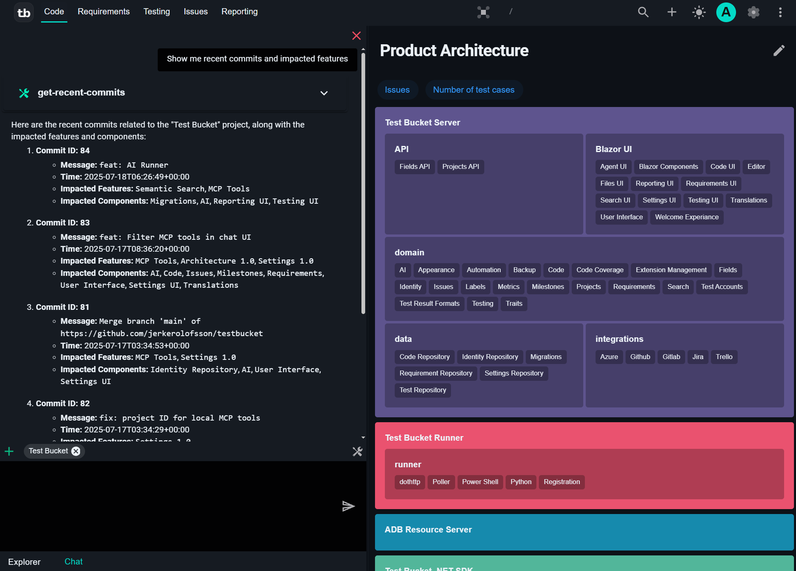
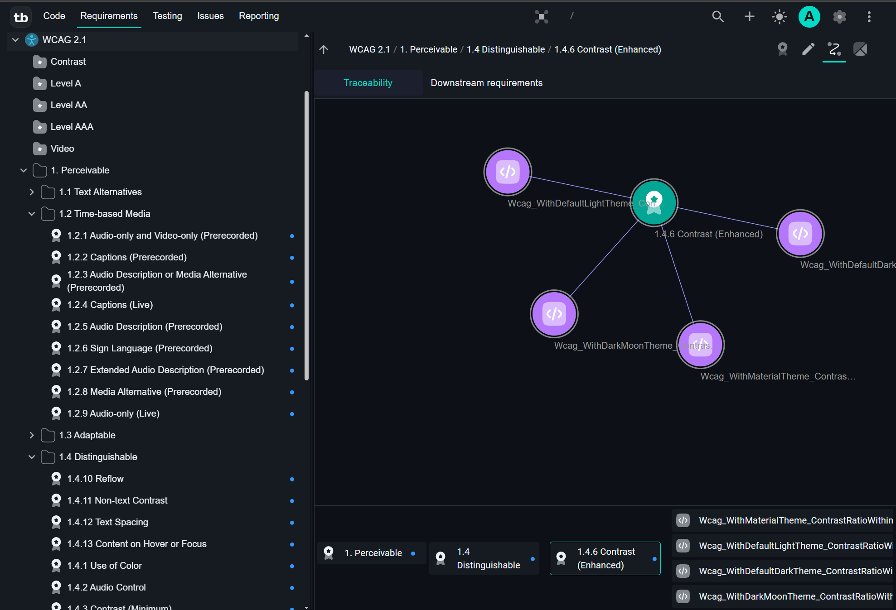
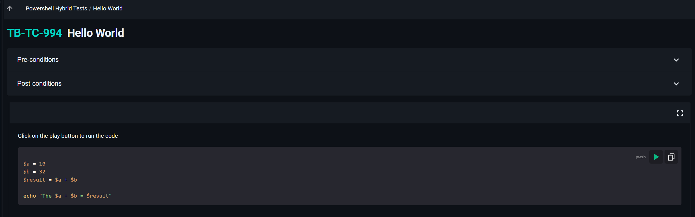

# testbucket

A modern test management system for manual and automated tests

## Key features

> Note that test bucket is currently in early development. The first stable release is not ready.

- Exploratory testing
- Management of manual test cases
- MCP Server with support for Claude, VS Code, Visual Studio
- Agent with access to internal tools and http/sse MCP servers
- Integrations with Github, Gitlab, Jira (Experimental, incomplete)
- CI/CD integration for import of automated test results or starting pipelines to run automated tests
- Requirement/Task management
- Traceability between requirements, tasks, and test cases
- Issue management
- Parameterized tests
- Templated tests
- Test environment configurations
- Test account management
- Test resources system for handling of resources such as Android devices

## Agent

Integrate with Ollama or a commercial AI provider to combine access to internal tools and external AI services.

## Traceability

Link requirements, tasks, and test cases to ensure traceability.

## Hybrid Tests

Mix code and manual tests in a single test case. 
This allows mixing manual and automated tests where only part of the test can be automated. 

Use cases can include invoking a tool to reset the state of a system followed by manual verification.